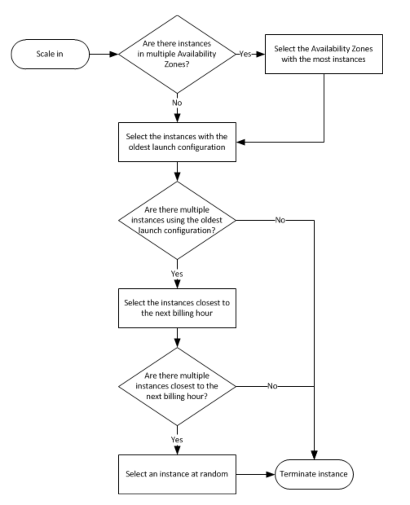

## What is ASG?

- The goal of an Auto Scaling Group (ASG) is to:
    - **Scale out (add EC2 instances)** to match an increased load
    - **Scale in (remove EC2 instances)** to match a decreased load
    - Ensure we have a minimum and a maximum number of machines running 
    - Automatically Register new instances to a load balancer

## ASG Basic

- Scaling policies can be on CPU, Network... and can even be on custom metrics or based on a schedule (if you know your visitors patterns)

- ASGs use Launch configurations or Launch Templates (newer)
    - To update an ASG, you must provide **a new launch configuration / launch template**
    - Launch Templates do support **a mix of On-Demand and Spot instances**
    - has versioning, so reuse.

- IAM roles attached to an ASG will get assigned to EC2 instances

- ASG are free.You pay for the underlying resources being launched    

- How it terminates instances
    - ASG tries the balance the number of instances across AZ by default    
    - Determine whether any of the instances use the oldest launch template or configuration
    - determine which unprotected instances are **closest to the next billing hour**. (This helps you maximize the use of your EC2 instances and manage your Amazon EC2 usage costs.)

## Auto Scaling Alarms
- Scale an ASG based on CloudWatch alarms 
- An Alarm monitors a metric (such as Average CPU)
    - can also base on a custom metric (ex: number of connected users)

## Auto Scaling New Rules
Define ”better” auto scaling rules that are directly managed by EC2
- Target Average CPU Usage
- Number of requests on the ELB per instance 
- Average Network In
- Average Network Out   

## Auto Scaling Groups – Scaling Policies

- Target Tracking Scaling
    -  based on **a target value for a specific metric.**
    - Most simple and easy to set-up
    - Example: I want the average ASG CPU to stay at around 40%

- Simple
    - based on **a single scaling adjustment**.
        - When a CloudWatch alarm is triggered (example CPU > 70%), then add 2 units 
        - When a CloudWatch alarm is triggered (example CPU < 30%), then remove 1

- Step
    - **based on a set of scaling adjustments,** known as step adjustments, that vary based on the size of the alarm breach.

- Scheduled Actions
    - Anticipate a scaling based on known usage patterns
    - Example: increase the min capacity to 10 at 5 pm on Fridays
    
Note: 
- The cooldown period helps to ensure that your AutoScaling group doesn't launch or terminate additional instances before the previous scaling activity takes effect.    
- If you are scaling based on a utilization metric that increases or decreases proportionally to the number of instances in an Auto Scaling group, we recommend that you use target tracking scaling policies. Otherwise, we recommend that you use step scaling policies.

## Launch configurations are immutable
Launch configurations are immutable meaning they cannot be updated. You have to create a new launch configuration, attach it to the ASG and then terminate old instances / launch new instances