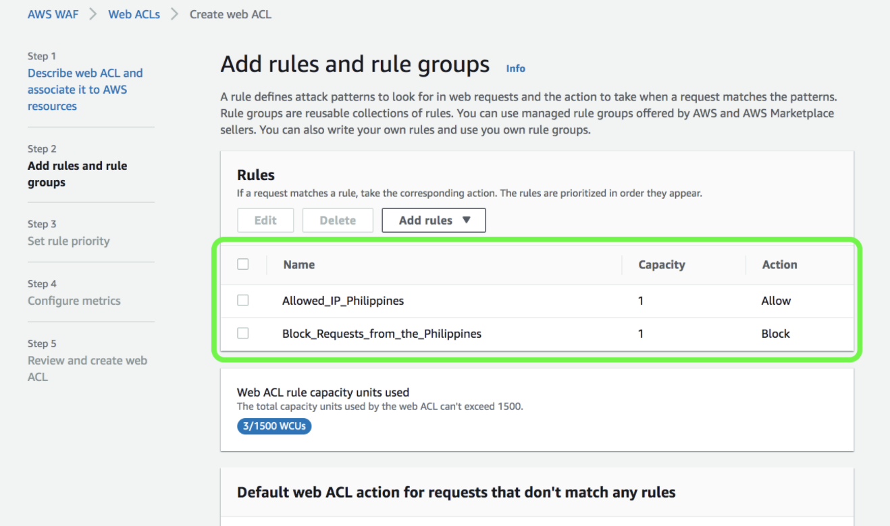

## AWS Shield (DDoS protection)
a **managed Distributed Denial of Service (DDoS) protection** service

- AWS Shield Standard:
    - Free service that is activated for every AWS customer
    - Provides protection from attacks such as SYN/UDP Floods, Reflection attacks and **other layer 3/layer 4 attacks**

- AWS Shield Advanced:
    - Optional **DDoS** mitigation service ($3,000 per month per organization)
    - Protect against more sophisticated attack on Amazon EC2, Elastic Load Balancing (ELB), Amazon CloudFront, AWS Global Accelerator, and Route 53
    - 24/7 access to AWS DDoS response team (DRP)
    - Protect against higher fees during usage spikes due to **DDoS**

- what is DDos?
Distributed denial-of-service attacks target websites and online services. The aim is to overwhelm them with more traffic than the server or network can accommodate. The goal is to render the website or service inoperable. 

## AWS WAF - Web App Firewall (Common web attacks in ALB, API Gateway, Cloudfront)

What is it?
- Protects your web applications from common web exploits (Layer 7) Note Layer 7 is HTTP, while Layer 4 is TCP
- Deploy on **Application Load Balancer, API Gateway, CloudFront** (Only 3, remember!)

How it works?  
- Define Web ACL (Web Access Control List):
    - Rules can include: IP addresses, HTTP headers, HTTP body, or URI strings
    - Protects from common attack - **SQL injection** and **Cross-Site Scripting (XSS)** 
    - Size constraints, geo-match (block countries)
    - **Rate-based rules** (to count occurrences of events) – for DDoS protection

Why:
- **block IPs, countries, or common web attacks**

    
 

  

## AWS Firewall Manager  

What is it?
- Manage rules in all accounts of an **AWS Organization** with **AWS Config**
    - enable WAF rules and Shield advance

How?
- Common set of security rules
- WAF rules (Application Load Balancer, API Gateways, CloudFront) • AWS Shield Advanced (ALB, CLB, Elastic IP, CloudFront)
- Security Groups for EC2 and ENI resources in VPC

Why?
- Simplify management of firewall rules across your accounts

## Shared Responsibility Model
https://aws.amazon.com/compliance/shared-responsibility-model/

Note: OS is in customer control, like packing & update. IAM, security, encryption, etc. 

 