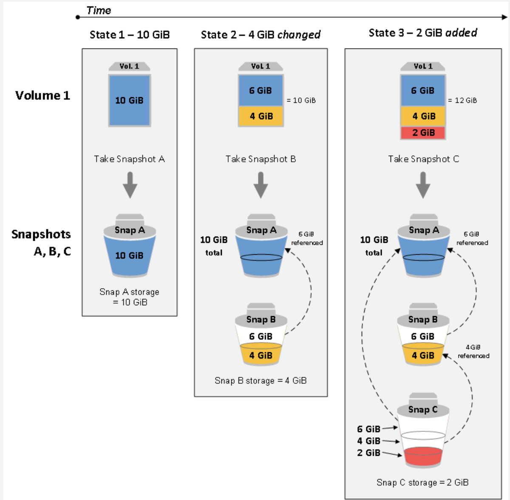

## what is EBS Volume?

Amazon Elastic Block Store (EBS) 

- the problem it solves: **An EC2 machine loses its root volume (main drive)** when it is manually terminated. Or your EC2 may be terminated from time to time due to AWS.
so you need a way to store your instance data

- EBS: Elastic Block Store Volume
    - **a network drive attaching to the instance so to persist data**
        - it uses the network to communicate the instance, so it has some latency. 
        - it is not a physical drive
        - mount on one EC2 instance at a time
        - **it is locked to AZ**, which means you cannot attach a EBS volume in one AZ to another. but you can migrate it by snapshot, and then create it from snapshot.
        - You have to **provision capacity (GB and IO/sec)**, but you get billed by the capacity, not how much you use. but you can increase the capacity

## Volume Types

4 types

SSD: General Purpose (SSD) volumes are suitable for a broad range of workloads, including small to medium sized databases, development, and test environments, and boot volumes.

- GP2: System boot volumes
    - General Purpose Volumes (**cheap**)
        - offer cost-effective storage that is ideal for a broad range of workloads.

- IO1: Large database workloads
    Provisioned IOPS (SSD) volumes offer storage with consistent and low-latency performance and are designed for **I/O intensive applications such as large relational or NoSQL databases**.
    - io1: Provisioned IOPS (expensive)
        - more suitable to meet the needs of **I/O-intensive database workloads** such as MongoDB, Oracle, MySQL, and many others
        - Unlike gp2, which uses a bucket and credit model to calculate performance, an io1 volume allows you to specify a consistent IOPS rate when you create the volume, and Amazon EBS delivers the provisioned performance 99.9 percent of the time.

HDD: 

- **Magnetic volumes** are ideal for workloads where data are accessed infrequently, and applications where **the lowest storage cost is important.** 

- ST1: Big Data, Data warehouse, log processing, **not a boot volume**
    - Throughput Optimized HDD
- SC1: lowest storage cost, **not boot volume**
    - Cold HDD, **Infrequently accessed data**    

## EBS Snapshots

- Incremental – only backup changed blocks
- EBS backups use IO and you shouldn’t run them while your application is handling a lot of traffic
- Snapshots will be stored in S3 (but you won’t directly see them)
- Not necessary to detach volume to do snapshot, but recommended
- Max 100,000 snapshots
- Can copy snapshots across AZ or Region
- Can make Image (AMI) from Snapshot
- EBS volumes **restored** by snapshots need to be **pre-warmed** (using fio or dd command to read the entire volume)
- **Snapshots can be automated using Amazon Data Lifecycle Manager** 

## EBS Encryption

When you create an encrypted EBS volume and attach it to a supported instance type, the following types of data are encrypted:

- Data at rest inside the volume

- All data moving between the volume and the instance

- All snapshots created from the volume

- All volumes created from those snapshots

Encryption operations occur on the servers that host EC2 instances, ensuring the security of both data-at-rest and data-in-transit between an instance and its attached EBS storage. You can encrypt both the boot and data volumes of an EC2 instance.

- encryption has a little impact on latency
- uses KMS
- can encrypt volume and snapshot
    - Snapshots of encrypted volumes are encrypted

## EBS RAID (Perf up, and fault tolerance)

- if OS supports, it can increase perf and fault tolerance

- RAID 0: **Combining 2 or more volumes** and getting the total disk space and I/O, 
    - but the downside is one disk fails, all the data is failed

- RAID 1: **Mirroring a volume to another**. 
    - If one disk fails, our logical volume is still working

## instance Store

- what is Instance Store? **a physical store attaching to EC2**, only some bigger EC2 has it. they don't have Root EBS volume.

- good: high I/O perf, cache, **data kept from reboot**
- bad: instance store is lost **after stop or termination**, cannot resize 

## Compare with S3

EBS Volumes are not as durable compared with S3 and it would be more cost-efficient if you directly store the documents to an S3 bucket. 

## Provision IOs

**The maximum ratio of provisioned IOPS to requested volume size (in GiB) is 50:1.**

For example, a 100 GiB volume can be provisioned with up to 5,000 IOPS. On a supported instance type, any volume 1,280 GiB in size or greater allows provisioning up to the 64,000 IOPS maximum (50 × 1,280 GiB = 64,000).

## Billing

When you stop an instance, AWS shuts it down but don't charge hourly usage for a stopped instance or data transfer fees, but AWS does charge for the storage of any Amazon EBS volumes.