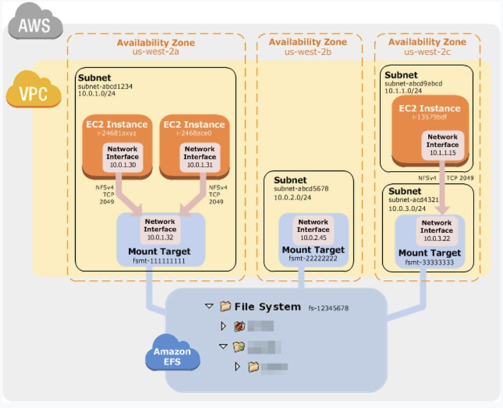

## What is EFS?

Elastic File System
- **fully Managed NFS (network file system) that can be mounted on many EC2s** 

- EFS works with multiple EC2 instances in multi-AZ, regions, and VPCs
    - can connect to Amazon EFS file systems from EC2 instances in other AWS regions using an inter-region VPC peering connection
        - EFS share website files (WordPress)
    -  from **on-premises servers** using an AWS VPN connection

- Highly available, scalable, but expensive (3x gp2), pay per use

- **compliant with Portable Operating System Interface (POSIX)** 

- has a file system interface
    - **strong consistency**
    - **file locking**

- **elastic**: automatically grow and shrink as you add and remove files

Note: 
- it is Linux only
- use SG to control access to EFS
- **EFS is higher price than EBS**
- shared file storage that is POSIX-compliant. 

## EFS Infrequent Access (EFS IA)

Amazon EFS Infrequent Access (EFS IA) is a storage class that provides price/performance that is **cost-optimized for files**, not accessed every day, with storage prices up to 92% lower compared to Amazon EFS Standard.

## EFS vs EBS vs S3

