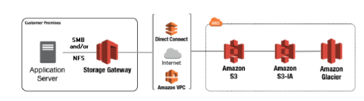
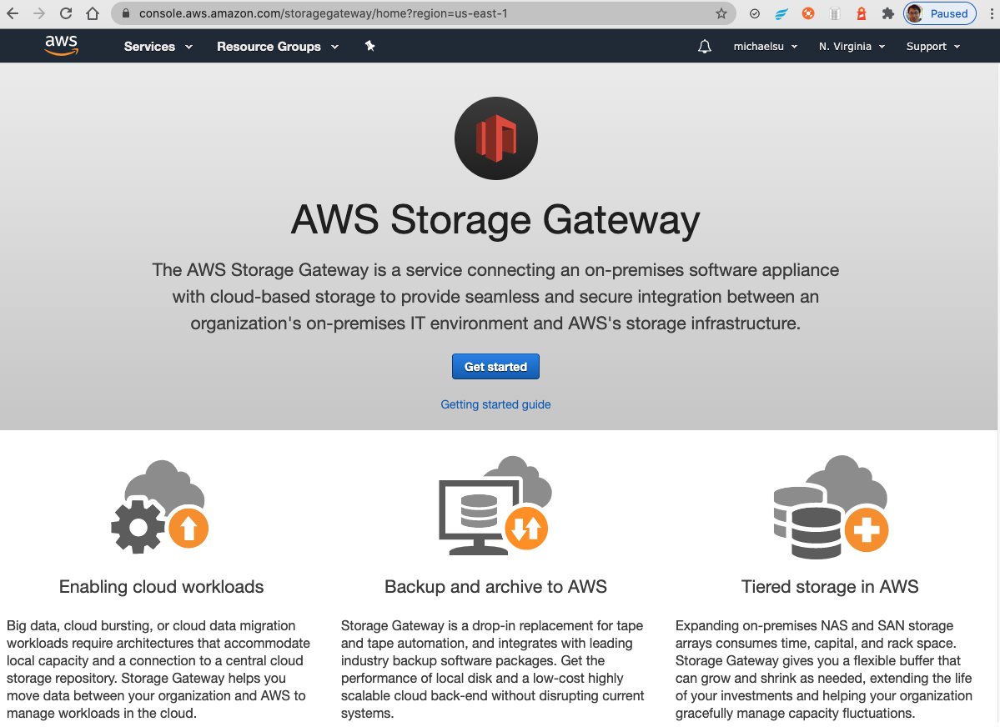
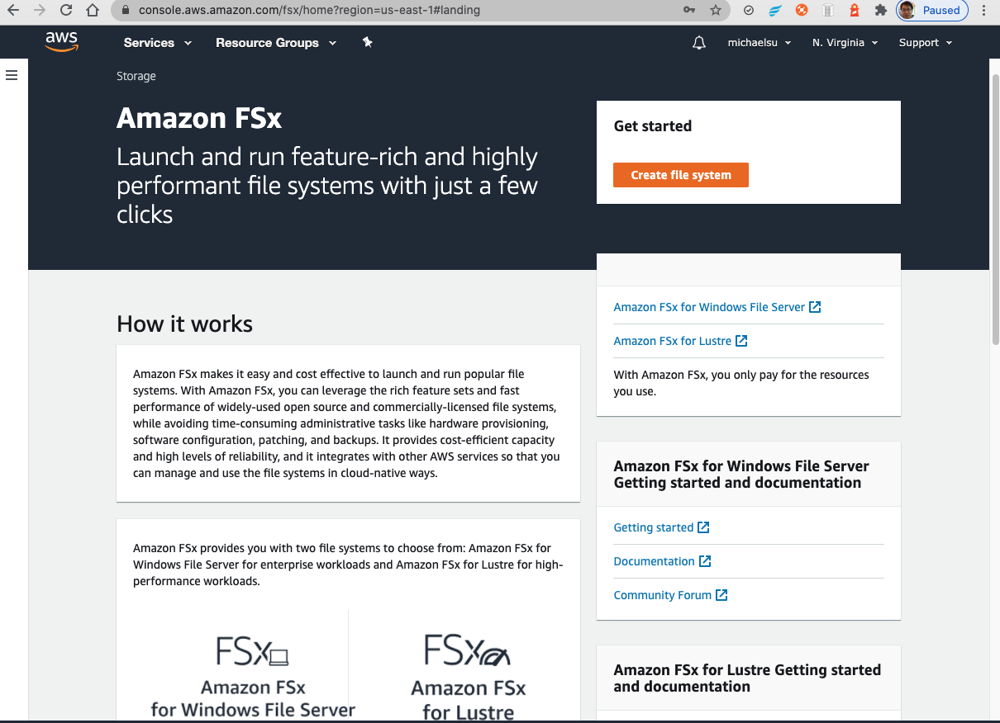

## AWS Storage Gateway

It connects **on-premise** software with cloud-based storage

Why?
- how do you expose the S3 data on-premise?
- hybrid cloud
- Bridge between on-premise data and cloud data in S3
- Use cases: disaster recovery, backup & restore, tiered storage

3 types of Storage Gateway: 
- File Gateway
    - accessible using **the NFS and Server Message Block(SMB) protocol**
- Volume Gateway
    - using **iSCSI protocol** backed by S3 
        - **cache & stored**
            - There are two options—cached and stored volumes. With cached volumes, you store volume data in AWS, with a small portion of recently accessed data in the cache on-premises. ... With stored volumes, you store the entire set of volume data on-premises and store periodic point-in-time backups (snapshots) in AWS.
- Tape Gateway
    - using physical tapes (!) - VirtualTape Library (VTL)

## FSx for Windows
- FSx for Windows is a fully managed Windows file system share drive

## FSx for Lustre

- Amazon FSx enables you to use Lustre file systems for any workload where storage speed matters.

- FSx for Lustre is a file system better suited for distributed computing for **HPC (high-performance computing)**    
    - The name Lustre is derived from “Linux” and “cluster”,e.g. Machine Learning, High Performance Computing (HPC)

- is **very expensive**

