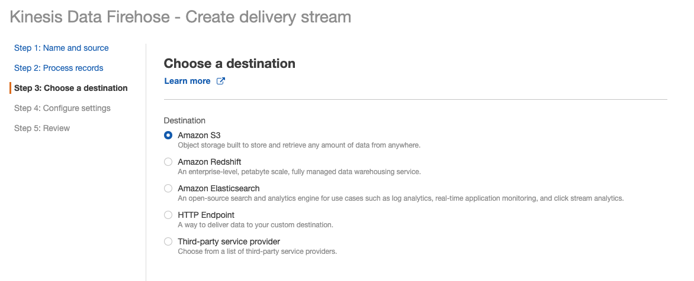
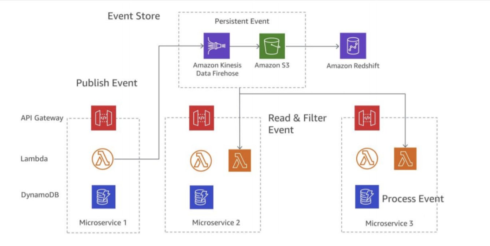

## Kinesis (Not under free tier)

- real time big data
    - app log, metrics, loT, streaming processing

- automatically replicated to 3 AZ

- Kinesis Streams: low latency streaming ingest at scale
- Kinesis Analytics: perform real-time analytics on streams using SQL 
- Kinesis Firehose: store streams into S3, Redshift, ElasticSearch...    

## Streams Overview

- It is a pipe, so the data retention is 1 day (7d max)
- the data is still there, so you can reprocess
- data cannot be deleted (immutability)

- shard
    - one stream is made of many diff shards
        - pay for shard provisioned
        - provision WRITE/READ for shard 1mb/s write, 2mb/s read
    - records are ordered per shard
        - the No of shards can change, evolvee

- Kinesis API
    -  PutRecord API
        - choose a partion key that is highly distributed, preventing hot partition
            e.g. user_id if many users, not country_id       
    - Exceptions
        -  ProvisionedThroughputExceeded Exceptions
              - Happens when sending more data (exceeding MB/s or TPS for any shard)
              - Make sure you don’t have a hot shard (such as your partition key is bad and too much data goes to that partition)
          - Solution:
            - Retries with backoff
            - Increase shards (scaling)
            - Ensure your partition key is a good one           

- Sending data into Kinesis
    - which shard to go to is based on the Partition Key

- User case:
    - website **clickstreams**, database event streams, financial transactions, social media feeds, IT logs, and location-tracking events.

## Firehose

- Fully Managed Service, no administration, automatic scaling, serverless

- Load data into Redshift / Amazon S3 / **ElasticSearch** / Splunk

- Near Real Time
    - 60 seconds latency minimum for non full batches 
    - Or minimum 32 MB of data at a time
- Supports many data formats, conversions, transformations, compression 

- Pay for the amount of data going through Firehose

 

- diff between Streams and Firehose
    - streams, need to write custom code,must manage scaling (shard), data storage for 1 to 7d.
    - firehose, serverless data transform with lambda, auto scaling, no data storage        

### Event Store

An event sourcing application is to be implemented using a microservice architecture on AWS. Each microservice consists of an API Gateway, AWS Lambda, and Amazon DynamoDB. The application will initialize when the first microservice publishes an event to an event store, then proceeds by consuming the data in the second microservice.

 

## Kinesis Analytics
it can take both Firehose and Streams data, and then do the analysis.

- Perform real-time analytics on Kinesis Streams using SQL

- Kinesis Data Analytics: • Auto Scaling

- Managed: no servers to provision • Continuous: real time
- Pay for actual consumption rate
- Can create streams out of the real-time queries   

## SQS vs SNS vs Kinesis

SQS:
- Consumer “pull data”
- Data is deleted after being consumed
- Can have as many workers (consumers) as we want
- No need to provision throughput
- No ordering guarantee (except FIFO queues)
- Individual message delay capability

SNS:
- Push data to many subscribers
- Upto10,000,000 subscribers
- Data is not persisted (lost if not delivered)
- Pub/Sub
- Upto100,000topics
- No need to provision throughput
- Integrates with SQS for fan- out architecture pattern

Kinesis:
- Consumers “pull data”
- As many consumers as we want
- Possibility to replay data
- Meant for real-time big data, analytics and ETL
- Ordering at the shard level
- Data expires after 1-7 days 
- Must provision throughput

- **it cannot send notification**

## Amazon MQ
- managed Apache ActiveMQ
    - help to app moving to the cloud, without re-engineering to use SQS/SNS

- create a broker, then use web console, then endpoints    

- Supports JMS, NMS, AMQP, STOMP, MQTT, and WebSocket 