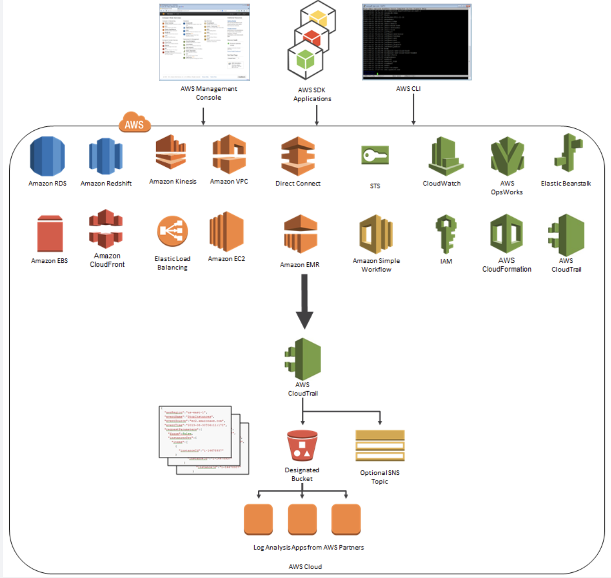
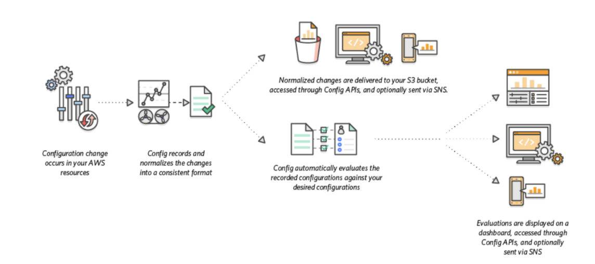

# CloudWatch

- can monitor EC2, DynamoDB table, RDS instance, custom metrics, and logs

## CloudWatch Metrics

- provide metrics for every service in AWS

- Metric is a variable to monitor, e.g. CPUUtilization.
    - belong to namespaces
    - has up to 10 Dimensions, e.g. instance_id, env
    - has timestamps

- Custom Metrics
    - define custom metrics
    - usee API call PutMetricData
    - Metric resolution (StorageResolution API parameter – two possible value): 
        - Standard: 1 minute (60 seconds)
        - High Resolution: 1 second – Higher cost

    -  Here's the list of custom metrics that you can set up:
      - **Memory utilization**
      - Disk swap utilization
      - Disk space utilization
      - Page file utilization
      - Log collection

- EC2 Instance Metrics
    - EC2 instance metrics have metrics “every 5 minutes”
    - With detailed monitoring (for a cost), you get data “every 1 minute”

## CloudWatch Dashboards
- Dashboards are global
- Dashboards can include graphs from different regions

- can change the time zone & time range of the dashboards 
- can setup automatic refresh (10s, 1m, 2m, 5m, 15m)     
  
- Pricing:
    - 3 dashboards (up to 50 metrics) for free 
    - $3/dashboard/month afterwards    

## CloudWatch Logs    
- app can send logs to CloudWatch using SDK

- CloudWatch can collect logs from:
    - Elastic Beanstalk, ECS, Lambda, VPC, API Gateway
    - CloudWatch log agents
    - CloudTrail based on filter
    - Route53: log DNS queries

- Logs can go to
    - S3 for archival    
    - Stream to **ElastiSearch cluster** for further analytics

- Logs storage architecture:
    - Log groups: arbitrary name, usually representing an application 
    - Log stream: instances within application / log files / containers

- Can define log expiration policies (never expire, 30 days, etc..)
- Using the AWS CLI we can tail CloudWatch logs
- To send logs to CloudWatch, make sure IAM permissions are correct! 
- Security: encryption of logs using KMS at the Group Level    

## CloudWatch Alarms
- Alarms are used to trigger notifications for any metric

- Alarms can go to Auto Scaling, **EC2 Actions**, SNS notifications • Various options (sampling, %, max, min, etc...)
    - The number of instances in an ASG cannot go below the minimum, even if the alarm would in theory trigger an instance termination
- High resolution custom metrics: can only choose 10 sec or 30 sec

## CloudWatch Events
- Event Pattern: Event rules to react to a service doing something eg: CodePipeline state changes!
- **Triggers to Lambda functions, SQS/SNS/Kinesis Messages**

- CloudWatch Event creates a small JSON document to give information about the change

## CloudWatch Agent

- install unified CloudWatch agent to do monitoring on windows/linux EC2 for monitoring

- Collect more system-level metrics from Amazon EC2 instances across operating systems. The metrics can include in-guest metrics, in addition to the metrics for EC2 instances. The additional metrics that can be collected are listed in Metrics Collected by the CloudWatch Agent.

- Collect system-level metrics from on-premises servers. These can include servers in a hybrid environment as well as servers not managed by AWS.

- Retrieve custom metrics from your applications or services using the StatsD and collectd protocols. StatsD is supported on both Linux servers and servers running Windows Server. collectd is supported only on Linux servers.

- Collect logs from Amazon EC2 instances and on-premises servers, running either Linux or Windows Server.

# CloudTrail
- Provides governance, compliance and audit for your AWS Account
    - track either user activity or API calls
    - CloudTrail helps audit the API calls made within your account, so the database deletion API call will appear here (regardless if made from the console, the CLI, or an SDK)
    - CloudTrail events provide **a history of both API and non-API account** activity made through the AWS Management Console, AWS SDKs, command line tools, and other AWS services. 
- CloudTrail is enabled by default!
    - for IT audits and API logging of all of your AWS resources.

- Get an history of events / API calls made within your AWS Account by: 
    - Console
    - SDK
    - CLI
    - AWS Services

- Can put logs from CloudTrail into CloudWatch Logs

- If a resource is deleted in AWS, look into CloudTrail first!

Pricing:
- can view, filter, and download 90 days free of charge
- https://aws.amazon.com/cloudtrail/pricing/

## Encryption

**By default, CloudTrail event log files are encrypted** using Amazon S3 server-side encryption (SSE). You can also choose to encrypt your log files with an AWS Key Management Service (AWS KMS) key. 

You can store your log files in your bucket for as long as you want. You can also define Amazon S3 lifecycle rules to archive or delete log files automatically. 

If you want notifications about log file delivery and validation, you can set up Amazon SNS notifications.

# AWS Config

What?

- Helps with auditing and recording compliance of your AWS resources
- Helps record configurations and changes over time

- Possibility of storing the configuration data into S3 (analyzed by Athena)

- Questions that can be solved by AWS Config:
    - Is there unrestricted SSH access to my security groups? 
    - Do my buckets have any public access?
    - How has my ALB configuration changed over time?

How it works?
Select resources to record, config S3 to store them, and then SNS topic to notify users.

- You can receive alerts (SNS notifications) for any changes • AWS Config is a per-region service

- Can be aggregated across regions and accounts

Pricing: 
- no free tier, $2 per active rule per region per month

# CloudWatch vs CloudTrail vs Config
- CloudWatch
    - Performance monitoring (metrics, CPU, network, etc...) & dashboards • Events & Alerting
    - Log Aggregation & Analysis

- CloudTrail
    - Record API calls made within your Account by everyone 
    - Can define trails for specific resources, who did what
    
- Config
    - Record configuration changes
    - Evaluate resources against compliance rules
    - Get timeline of changes and compliance