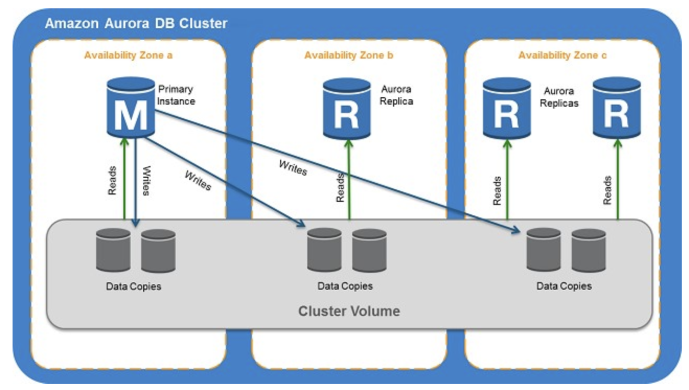

## Aurora
- Aurora is a proprietary technology from AWS (not open sourced)
- Postgres and MySQL are both supported as Aurora DB (that means your drivers will work as if Aurora was a Postgres or MySQL database)

- Aurora is “AWS cloud optimized” and claims **5x performance improvement** over MySQL on RDS, over 3x the performance of Postgres on RDS
- Aurora **storage automatically grows in increments of 10GB**, up to 64 TB.
- Aurora can have **15 replicas** while MySQL has 5, and the replication process
is faster (sub 10 ms replica lag) (auto scaling in read)
- **Failover in Aurora is instantaneous. It’s HA (High Availability) native**.
    - less than 30sec
    - support for cross region replication
- Aurora costs more than RDS (20% more) – but is more efficient

- Security
    - same as RDS
    
    
- Aurora Serverlss 
    - **Good for infrequent, intermittent or unpredictable workloads**
        -  a DB cluster that automatically starts up, shuts down, and scales up or down its compute capacity based on your application's needs.
    - No capacity planning needed
    - Pay per second, can be more cost-effective

- Aurora non-serverless DB Cluster
    - provisioned DB Cluster
        - choose your DB instance class size and create Aurora Replicas to increase read throughput. If your workload changes, you can modify the DB instance class size and change the number of Aurora Replicas. 
        - you can create a database endpoint without specifying the DB instance class size. You set the minimum and maximum capacity.
        - the database endpoint connects to a proxy fleet that routes the workload to a fleet of resources that are automatically scaled.     
    
- Cross Region Read Replicas & Global DB 
    - What is Aurora global database?
      Amazon Aurora Global Database is a new feature in the MySQL-compatible edition of Amazon Aurora, designed for applications with a global footprint. It allows a single Aurora database to span multiple AWS regions, with fast replication to enable low-latency global reads and disaster recovery from region-wide outages.    

- **combines the performance and availability** of traditional enterprise databases with the simplicity and cost-effectiveness of open source databases.  

### Endpoint

Amazon Aurora typically involves a cluster of DB instances instead of a single instance. Each connection is handled by a specific DB instance. When you connect to an Aurora cluster, the hostname and port that you specify point to an intermediate handler called an endpoint. 

Aurora uses **the endpoint mechanism** to abstract these connections. Thus, you don't have to hardcode all the hostnames or write your own logic for load-balancing and rerouting connections when some DB instances aren't available.

 

- a **cluster endpoint (also known as a writer endpoint)** simply connects to the current primary DB instance for that DB cluster. This endpoint can perform write operations in the database such as DDL statements, which is perfect for handling production traffic but not suitable for handling queries for reporting since there will be no write database operations that will be sent.

- a reader endpoint
    -  doing read operations only

- The **custom endpoint ** provides **load-balanced database connections** based on criteria other than the **read-only or read-write** capability of the DB instances.

### Parallel Query
this feature simply enables Amazon Aurora to push down and distribute the computational load of a single query across thousands of CPUs in Aurora's storage layer. 

### Failover

Failover is automatically handled by Amazon Aurora so that your applications can resume database operations as quickly as possible without manual administrative intervention.

- If you have an Amazon **Aurora Replica** in the same or a different Availability Zone, when failing over, Amazon Aurora flips the canonical name record (CNAME) for your DB Instance to point at the healthy replica, which in turn is promoted to become the new primary. Start-to-finish, failover typically completes within 30 seconds.

- If you are running **Aurora Serverless** and the DB instance or AZ become unavailable, Aurora will automatically recreate the DB instance in a different AZ.

- If you do not have an Amazon Aurora Replica (**i.e. single instance**) and are not running Aurora Serverless, Aurora will attempt to create a new DB Instance in the same Availability Zone as the original instance. This replacement of the original instance is done on a best-effort basis and may not succeed, for example, if there is an issue that is broadly affecting the Availability Zone.

 

