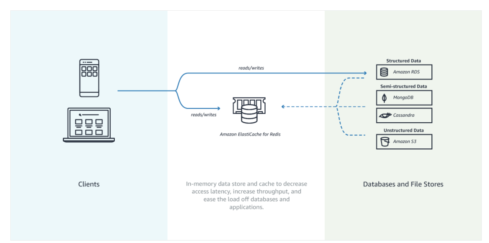

## What is it?
ElastiCache is to get managed Redis or Memcached

- The same way RDS is to get managed Relational Databases...
- ElastiCache is to get managed Redis or Memcached
- Caches are in-memory databases with really high performance, low latency
- Helps reduce load off of databases for read intensive workloads
- Helps make your application stateless
- AWS takes care of OS maintenance / patching, optimizations, setup, configuration, monitoring, failure recovery and backups
- Using ElastiCache involves heavy application code changes

## Use Case in Solution Architecture

- DB Cache
    - helps relieve load in RDS
    - Cache must have an invalidation strategy to make sure only the most current data is used in there.

- User Session for **distributed session management**
    - app writes session data into ElastiCache
    - then user hits another instance of the app
    - the instance retrieves the data and the user is already logged in  

    
## Redis VS Memcached

Redis
- Multi AZ with Auto-Failover
- Read Replicas to scale reads and have high availability
- Data Durability using AOF persistence
- Backup and restore features 

### Redis Auth
Redis authentication tokens enable Redis to require a token (password) before allowing clients to execute commands, thereby improving data security.

MEMCACHED
- Multi-node for partitioning of data (sharding)
- Non persistent
- No backup and restore
- Multi-threaded architecture

## Cache Security

All caches in ElastiCache:
- Support SSL in flight encryption
- **Do not support IAM authentication**, while IAM policies on ElastiCache are only used for AWS API-level security

## Patterns for ElastiCache
- Lazy Loading: all the read data is cached, data can become stale in cache
- WriteThrough: update data in the cache when written to a DB (no stale data)
- Session Store: store temporary session data in a cache (using TTL features)   

Quote:There are only two hard things in Computer Science: cache invalidation and naming things

### with DB
it caches db query results

