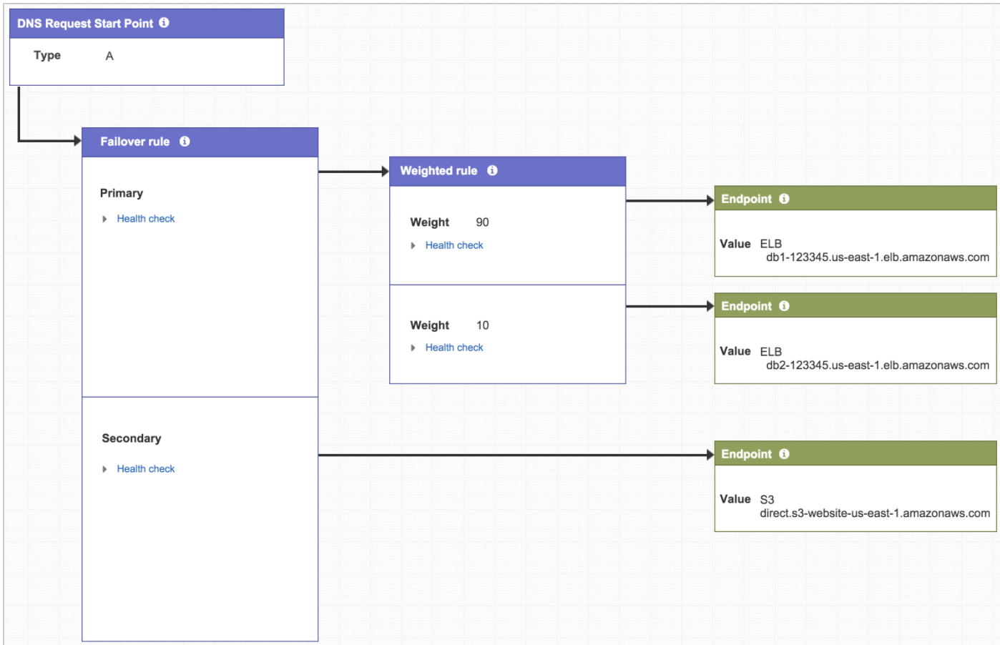

## DNS Traffic

To divert 50% of the traffic to the new application in AWS and the other 50% to the application, you can also use Route 53 with Weighted routing policy. This will divert the traffic between the on-premises and AWS-hosted application accordingly.

Weighted routing lets you associate multiple resources with a single domain name (tutorialsdojo.com) or subdomain name (portal.tutorialsdojo.com) and choose how much traffic is routed to each resource. This can be useful for a variety of purposes, including load balancing and testing new versions of software. You can set a specific percentage of how much traffic will be allocated to the resource by specifying the weights.

Note: ELB has weighted routing as well, helping the same thing