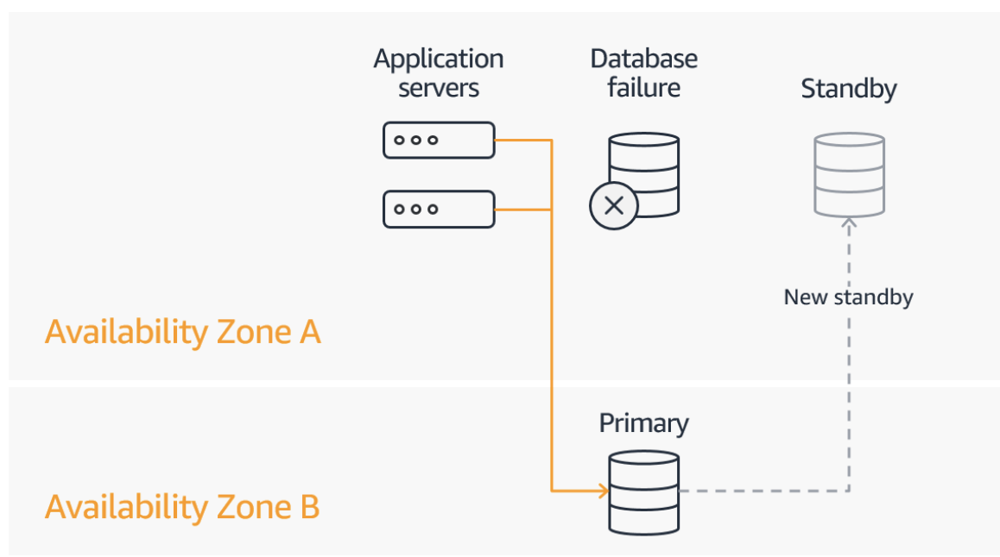
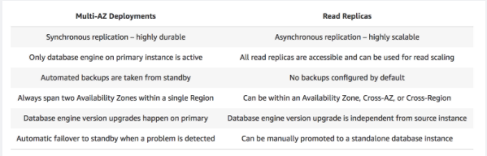

## RDS -Relational Database Service

- It’s a managed DB service for DB use SQL as a query language.
    - Postgres
    - MySQL
    - MariaDB
    - Oracle
    - Microsoft SQL Server
    - Aurora (AWS Proprietary database)
    
- Benefits over deploying DB on EC2
    - managed service with automated provisioning, OS patching, backup, monitoring, read replica for better read perf, multi AZ for diaster recovery, scaling, storage backed by EBS
    - downside: cannot SSH the instance  

## RDS Backups

- auto enabled
- retention 7days to 35 days max
- able to store any point to 5 min ago
- daily full backup during maintain window  

## Read Replicas

- up to 5 replicas
- can within AZ, cross, or cross region
    - if cross AZ, there is a cost, so can do it within AZ
- it is ASYNC, so reads are eventually consistent
- app needs to update connect string so to use them

- use case: 
    - doing analysis on prod data, but don't need to change the data.
    - so it does not affect prod app.
    - main purpose is scalability
    
## Multi AZ

Amazon RDS Multi-AZ deployments provide enhanced availability and durability for Database (DB) Instances, making them a natural fit for production database workloads. 

When you provision a Multi-AZ DB Instance, Amazon RDS automatically creates a primary DB Instance and **synchronously replicates** the data to a standby instance in a different Availability Zone (AZ). 

Each AZ runs on its own physically distinct, independent infrastructure, and is engineered to be highly reliable.

In case of an infrastructure failure, Amazon RDS performs an **automatic failover** to the standby (or to a read replica in the case of Amazon Aurora), so that you can resume database operations as soon as the failover is complete. 

Since the endpoint for your DB Instance remains the same after a failover, your application can resume database operation without the need for manual administrative intervention.

-  SYNC replication
- **One DNS name – automatic app failover to standby**, so Increase availability
- Failover in case of loss of AZ, loss of network, instance or storage failure
- No manual intervention in apps (**automatically** done)

Note:The Read Replicas be setup as Multi AZ for Disaster Recovery (DR)  

Failover is automatically handled by Amazon RDS so that you can resume database operations as quickly as possible without administrative intervention. 
- When failing over, Amazon RDS simply flips the **canonical name record (CNAME) for your DB instance to point at the standby, which is in turn promoted to become the new primary.**
- Multi-AZ means the URL is the same, the failover is automated, and the CNAME will automatically be updated to the point to the standby database.    

## Security

- Encryption
    - at rest
        - if master is not encrypted, read replicas cannot be encrypted
    - in-flight
        - SSL cert to encyrpt data to RDS in flight
    - can encrypt backup as well.    
        
- Network
    - usually deployed at a private subnet, not public
    - **leverage SG, controlling which IP/SG can communicate with RDS**

- IAM
    - IAM policies help control who can manage AWS RDS (through the RDS API)
    - Traditional Username and Password can be used to login into the database
    - **IAM-based authentication** can be used to login into RDS MySQL & PostgreSQL
        - You can authenticate to your DB instance using AWS Identity and Access Management (IAM) database authentication. IAM database authentication works with MySQL and PostgreSQL. With this authentication method, you don't need to use a password when you connect to a DB instance. 
        Instead, you **use an authentication token**, which has a 15min lifetime.    
    
- Encryption at rest:
    - Is done only when you first create the DB instance
    - or: unencrypted DB => snapshot => copy snapshot as encrypted => create DB from snapshot

Your responsibility:
- Check the ports / IP / security group inbound rules in DB’s SG
- In-database user creation and permissions or manage through IAM
- Creating a database with or without public access
- Ensure parameter groups or DB is configured to only allow SSL connections    

## Enhanced Monitoring in RDS

Enhanced Monitoring metrics are useful when you want to see how different processes or threads on a DB instance use the CPU.
- if you want to monitor DB logs, then use enhanced monitoring, not CloudWatch.
    - Note: CloudWatch - although you can use this to monitor the CPU Utilization of your database instance, it does not provide the percentage of the CPU bandwidth and total memory consumed by each database process in your RDS instance.

- RDS children process
- RDS process
- OS process

## DB authentication token

- manage DB access using IAM users and roles (aka profile credential)

a unique string of characters that Amazon RDS generates on request. Authentication tokens are generated using AWS Signature Version 4. Each token has a lifetime of 15 minutes. You don't need to store user credentials in the database, because authentication is managed externally using IAM.
- you can use profile credentials specific to your EC2 instance to access your database instead of a password, for greater security

STS, not with DB, it works with federate sign-on.

## vs NoSQL DB

RDS works for online transaction processing and online analytica application

## SSL/HTTPS connection between server and rds?

- Force all connections to your DB instance to use SSL by setting the rds.force_ssl parameter to true. Once done, reboot your DB instance.

- Download the Amazon RDS Root CA certificate. Import the certificate to your servers and configure your application to use SSL to encrypt the connection to RDS.
