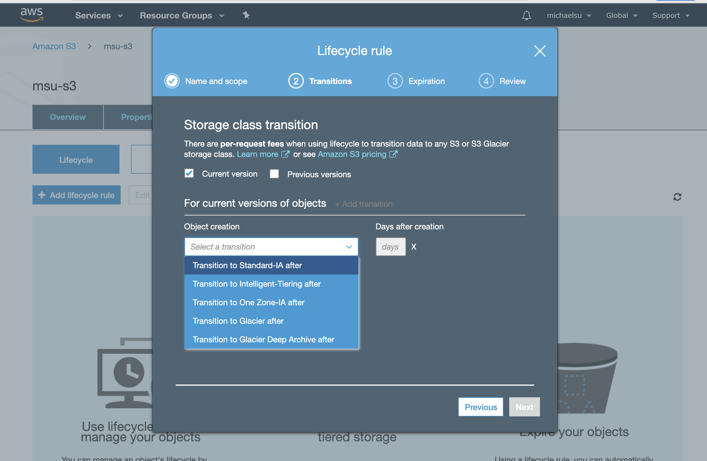

## S3 Access Logs
- Create a bucket for logging, and set it for the original bucket

- The data can be analyzed using Athena

- Do not make the original bucket to be the logging bucket.

## S3 Replication
- **Cross Region** & Same Region Replication
    - enable Cross-Region Replication to ensure that your S3 bucket would not be affected even if there is an outage in one of the Availability Zones or a regional service failure in us-east-1. 
    - When you upload your data in S3, your objects are redundantly stored on multiple devices across multiple facilities **within the region only**, where you created the bucket. 
    - Thus, if there is an outage on the entire region, your S3 bucket will be unavailable if you do not enable Cross-Region Replication, which should make your data available to another region.

- Delete, not replicated

- Only new objects are replicated after activating

- Why need it? 
    - CRR - Use cases: compliance, lower latency access, replication across accounts
    - SRR – Use cases: log aggregation, live replication between production and test accounts

## S3 Pre-Signed URL
Pre-Signed URL are temporary and grant time-limited access to some actions in your S3 bucket.

## S3 Select & Glacier
- what is the problem?
Traditionally when you get a object from S3, you get the whole entity.

With S3 Select & Glacier select, you can **use simple SQL to pull out only the bytes you need**.

- How?
needs bucket name + object key from a csv file

- what is the use case?
Analyze weekly sales data for a single store, where the data for all 100 stores is in a new CSV every day. Without it, you need to process the whole CSV data.

- Benefits
faster, save cost - why become less data is processed, so performance is improved. 

- what about Glacier select?

so what is Glacier? it is like archive. when you have some data, you don't want to access on a regular basis. 

similarly like S3 Select, Glacier select allows to perform filtering directly against a Glacier object using SQL statement.

- Reference
https://aws.amazon.com/blogs/aws/s3-glacier-select/

## S3 Object & Glacier Lock

- Use Case: it ensures nobody can touch those stored objects.

## How to retrieve S3 objects in Glacier

**Expedited retrievals** allow you to quickly access your data when occasional urgent requests for a subset of archives are required. For all but the largest archives (250 MB+), data accessed using Expedited retrievals are typically made available within 1–5 minutes. Provisioned Capacity ensures that retrieval capacity for Expedited retrievals is available when you need it.

**Provisioned capacity** ensures that your retrieval capacity for expedited retrievals is available when you need it.

https://docs.aws.amazon.com/amazonglacier/latest/dev/downloading-an-archive-two-steps.html

## How to copy objects across accounts?

To be sure that a destination account owns an S3 object copied from another account, grant the destination account the permissions to perform the cross-account copy. Follow these steps to configure cross-account permissions to copy objects from a source bucket in Account A to a destination bucket in Account B:

- Attach a bucket policy to the source bucket in Account A.

- Attach an AWS Identity and Access Management (IAM) policy to a user or role in Account B.

- Use the IAM user or role in Account B to **perform the cross-account copy**.
    - You can use an IAM role to delegate access to resources that are in different AWS accounts that you own. You share resources in one account with users in a different account. By setting up cross-account access in this way, you don't need to create individual IAM users in each account. In addition, users don't have to sign out of one account and sign into another in order to access resources that are in different AWS accounts.

https://aws.amazon.com/premiumsupport/knowledge-center/cross-account-access-s3/

## Event Notification
Events -> S3 , which can go in SNS, SQS, Lambda

## AWS Athena
- Amazon Athena is an interactive query service that allows you to query data from Amazon S3, without the need for clusters or data warehouses.

- Exam Tip: Analyze data directly on S3 => use Athena

- Use cases: Business intelligence / analytics / reporting, analyze & query
  VPC Flow Logs, ELB Logs, CloudTrail trails, etc...
  
- You don't need to provision a RDS to do the analysis and also the data never leaves AWS, because it is in S3

## Storage Class
moving to archive
- Standard -> Intelligent Tiering -> Standard -IA (Infrequent Access)-> One Zone -IA -> Glacier -> Glacier (Deep Archive)

Note: Cost is important factor to consider as well if avaiability is not a big concern.
    - for example, can store in One Zone-IA, compared to Standard-IA.

- standard
    -  the standard storage class 

- Intelligent Tiering
    - The S3 Intelligent-Tiering storage class is designed to optimize costs by automatically moving data to the most cost-effective access tier, without performance impact or operational overhead. 
    - It works by storing objects in **two access tiers**: one tier that is optimized for frequent access and another lower-cost tier that is optimized for infrequent access. 
    - **The minimum storage duration charge is 30 days.**
    - When you don't know the access patterns of your objects or your access patterns are changing over time, you can transition the objects to the INTELLIGENT_TIERING storage class for automatic cost savings.  

- S3 Standard-IA 
    - is for data that is accessed less frequently, but **requires rapid access when needed**

- S3 One Zone-IA
    - S3 One Zone-IA stores data in **a single AZ** and costs 20% less than S3 Standard-IA. 

- Amazon S3 Glacier (min 90d storage) and S3 Glacier Deep Archive (min 180d storage)
    - extremely low-cost
    - not for rapid retrieval, transition your data to the GLACIER storage class in case you want to archive objects that you don't need to access in real time.
    - You can use **expedited retrievals in Glacier which will allow you to quickly access your data (within 1–5 minutes)** when occasional urgent requests for a subset of archives are required.
    - although **DEEP_ARCHIVE** storage class provides the most cost-effective storage option, it does not have the ability to do expedited retrievals, unlike Glacier. In the event that the surprise annual data audit happens, it may **take several hours** before you can retrieve your data.

    - Note:
        - **Bulk retrievals are S3 Glacier’s lowest-cost retrieval** option, enabling you to retrieve large amounts, even petabytes, of data inexpensively in a day. 
        - Bulk retrievals typically complete within **5 – 12 hours**. You can specify an absolute or relative time period (including 0 days) after which the specified Amazon S3 objects should be transitioned to Amazon Glacier.

- can move between storage classes with certain rules
    - **note: - Objects must be stored at least 30 days in the current storage class before you can transition them to STANDARD_IA or ONEZONE_IA.**
    - This limitation does not apply on GLACIER and DEEP_ARCHIVE storage class.
## Lifecycle Rules

- includes transition and expiration actions

- rules can apply to **prefix or object tags**
    - so the rule does not apply to all objects

- use lifecycle policies to move them

## S3 Performance

- multi-part upload (**must use above 5GB**)

- transfer acceleration (first to edge location, then private aws net to a region)

- Byte-Range Fetch: can be used to speed up downloads.
    - fetch different byte ranges from within the same object. This helps you achieve higher aggregate throughput versus a single whole-object request. 

## To restrict access to content that you serve from Amazon S3 buckets

- Create a special CloudFront user called **an origin access identity (OAI)** and associate it with your distribution. 
- Configure your S3 bucket permissions so that CloudFront can use the OAI to access the files in your bucket and serve them to your users. 

Note: You cannot attach IAM roles to the CloudFront distribution. S3 buckets don't have security groups. Here **you need to use an OAI**.

https://docs.aws.amazon.com/AmazonCloudFront/latest/DeveloperGuide/private-content-restricting-access-to-s3.html

## S3 Glacier and Deep Archive
**extremely low-cost** Amazon S3 cloud storage classes for data archiving and **long-term backup.**

## Snowball
a data migration service

You can't move data directly from Snowball into Glacier, **you need to go through S3 first, and use a lifecycle policy.**

## Snowball Mobile

- Each Snowmobile has 100 PB of capacity (use multiple in parallel) 
- Better than Snowball if you transfer more than 10 PB

## S3 Transfer Acceleration

Amazon S3 Transfer Acceleration enables fast, easy, and secure transfers of files over **long distances** between your client and your Amazon S3 bucket. 

Transfer Acceleration leverages Amazon CloudFront’s globally distributed AWS Edge Locations. As data arrives at an AWS Edge Location, data is routed to your Amazon S3 bucket over an optimized network path.

## Data Security and Audit in S3

### AWS Macie

Amazon Macie uses machine learning to **recognize sensitive data such as personally identifiable information (PI**I) or intellectual property, assigns a business value, and provides visibility into where this data is stored and how it is being used in your organization.

**- ML to identify PII or IP**

### AWS Inspector

Inspector is basically an automated **security assessment** service that helps improve the security and compliance of applications deployed on AWS.
- security assessment to improve security and compliance
- help test the network accessibility of your Amazon EC2 instances and the security state of your applications running on the instances

### Rekognition
Rekognition is simply a service that can identify the objects, people, text, scenes, and activities, as well as **detect any inappropriate content** on your images or videos.

### GuardDuty

GuardDuty is just a threat detection service that continuously monitors for **malicious activity and unauthorized behavior** to protect your AWS accounts and workloads.
- threat detection service

## Questions

s3:ObjectRemoved:DeleteMarkerCreated type is only triggered when a delete marker is created for a versioned object. Remember that the scenario asked to publish events when an object is deleted or a versioned object is permanently deleted.

