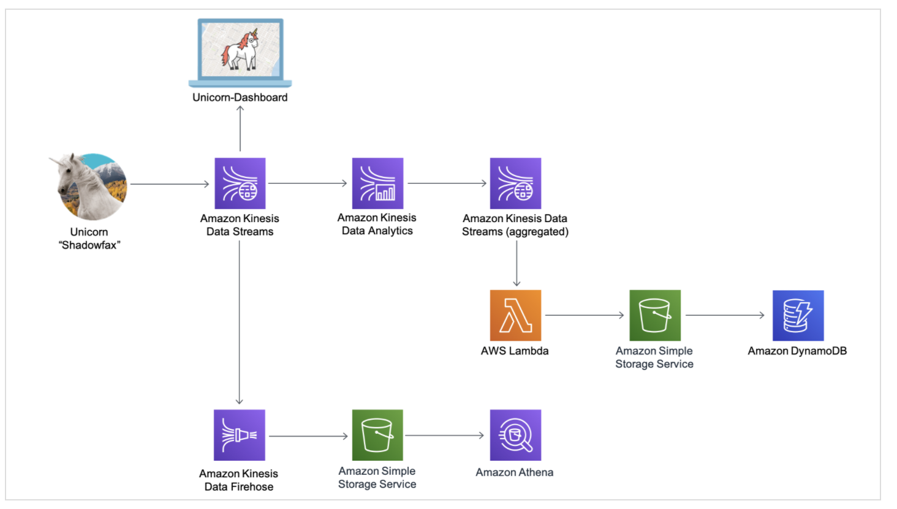

# Serverless
- a paradigm, you don't manage servers, means, no provision EC2,
- function as a service, just deploy code

## Lambda

### Basics
- no servers to manage (no EC2), means, not limited by machine resources, no need to add/remove instances.
- price is cheap (pay per request, free tier 1m request, pay per duration, 400,000GB-sec per month)
   means 400,000 secs - func is 1GB


features

- scaling is automated
- run on demand
- short exec

limits

- up to 3 GB memory
- max exec 15 mins
- 4kb env
- file 512 MB
- deployment: max size 50MB (compress), max size 250MB (uncompress)

### Lambda @edge
what is it? - deploy lambda along with CDN, why? customize CDN content

use cases
- security, **auth/auth check**, check content
- privacy, remove customer content
- image transform
- user tracking and analytics

It can change CDN requests and respones

### use Env variables

- it uses AWS KMS. 
    - The first time you create or update Lambda functions that use environment variables in a region, a default service key is created for you automatically within AWS KMS. This key is used to encrypt environment variables. 
    - However, if you wish to use encryption helpers and use KMS to encrypt environment variables after your Lambda function is created, you must create your own AWS KMS key and choose it instead of the default key. The default key will give errors when chosen. Creating your own key gives you more flexibility, including the ability to create, rotate, disable, and define access controls, and to audit the encryption keys used to protect your data.


### Integate with CloudWatch
AWS Lambda monitors functions on your behalf and sends metrics to Amazon CloudWatch. The metrics include total requests, duration, and error rates. 
https://docs.aws.amazon.com/lambda/latest/dg/monitoring-functions-access-metrics.html

## DynamoDB

### Basic
- full managed, you don't need to create DB
- **NoSQL data**, so not a RDS DB
- Scale to mass load/ very low latency on read
- HA and ASG

features

- table
- primary key
- infinte rows
- each item has attributes, max size 400KB per item

- RCU/WCU are decoupled, so WCU can stay the same

    throughput for reads or writes
    
    can set up auto-scaling to meet demand.

### Advanced
- DAX = DynamoDB Accelerator, good for read (solve the Hot key problem, too many reads)

Amazon DynamoDB Accelerator (DAX) is a fully managed, highly available, in-memory cache for Amazon DynamoDB that delivers up to a 10 times performance improvement—from milliseconds to microseconds—even at millions of requests per second.
    - DAX is used for caching reads, not to help with writes.
    - Using SQS as a middleware will help us sustain the write throughput during write peaks

     


   - Handson: https://aws.amazon.com/blogs/database/a-walkthrough-of-the-amazon-dynamodb-accelerator-console-part-2/
       - use `Target DynamoDB table` to set the target table 
- Streams, changelogs, to stream in Lambda, usage - analytics, 24 hours of data retention

### DynamoDB Autoscaling

### Compare with RDS

In RDS, you still have to manually scale up your resources and create Read Replicas to improve scalability while in DynamoDB, this is automatically done.

Also, in RDS, you still have to handle the backups and other administrative tasks such as when the automated OS patching will take place.

## Cognito
- Cognito User Pools (CUP)
    
    simple login with user/pass, sign in func for app user
    
    for your mobile apps
    
    JWT token (Json Web Token)
    
    integrate with API Gateway
 

- Federate Identity Pools
   provide direct access from client side    
    
   
- Cognito Sync

    sync data from device to cognito

    deprecated - use AWS AppSync  

## API Gateway

- Amazon API Gateway is a fully managed service that makes it easy for developers to create, publish, maintain, monitor, and secure APIs at any scale.

-  API Gateway supports **containerized** and serverless workloads, as well as web applications.

- throttling limit
    - The Throttling filter enables you to limit the number of requests that pass through an API Gateway in a specified time period. This enables you to enforce a specified message quota or rate limit on a client application, and to protect a back-end service from message flooding.

### Caching
You can enable API caching in Amazon API Gateway to cache your endpoint's responses. 

- With caching, you can reduce the number of calls made to your endpoint and also improve the latency of requests to your API. 
- When you enable caching for a stage, API Gateway caches responses from your endpoint for a specified time-to-live (TTL) period, in seconds. 

- The default TTL value for API caching is 300 seconds. The maximum TTL value is 3600 seconds. TTL=0 means caching is disabled.    
    
## SAM - Serverless App Model
what is it? 

- develop and deploy serverless app, via YAML code
- can run locally to debug
- can use CodeDeploy to deploy the app

need a deep div  

- it is a CLI to install it   https://aws.amazon.com/serverless/sam/
- AWS SAM is an extension of AWS CloudFormation
- integrate with AWS CI/CD tools, other services.

## Tutorial 1
https://aws.amazon.com/getting-started/hands-on/build-serverless-web-app-lambda-apigateway-s3-dynamodb-cognito/module-3/

### Questions

#### How does Frontend code with with Cognito? what is the flow?
Cognito is integrated with API gateway

1. frontend first sign up a user, by sending user to Cognito
2. Cognito will send email to ask user to verify, and also confirm the user
3. then user is able to continue by getting JWT token
4. then use the token to send to API Gateway
5. since API gateway is integrated with Cognito so it can auth the user
6. return with the data

#### How does Frontend code invoke with backend code?
ride.js will react to button click

```bash
function requestUnicorn(pickupLocation) {
        $.ajax({
            method: 'POST',
            url: _config.api.invokeUrl + '/ride',
            headers: {
                Authorization: authToken
            },
            data: JSON.stringify({
                PickupLocation: {
                    Latitude: pickupLocation.latitude,
                    Longitude: pickupLocation.longitude
                }
            }),
            contentType: 'application/json',
            success: completeRequest,
            error: function ajaxError(jqXHR, textStatus, errorThrown) {
                console.error('Error requesting ride: ', textStatus, ', Details: ', errorThrown);
                console.error('Response: ', jqXHR.responseText);
                alert('An error occured when requesting your unicorn:\n' + jqXHR.responseText);
            }
        });
    }
```

#### How does backend API work with DynamoDB?
1. API will invoke lambda function
2. lambda function write the record for new ride as below
```bash
function recordRide(rideId, username, unicorn) {
    return ddb.put({
        TableName: 'Rides',
        Item: {
            RideId: rideId,
            User: username,
            Unicorn: unicorn,
            UnicornName: unicorn.Name,
            RequestTime: new Date().toISOString(),
        },
    }).promise();
}
```

## What is JWT? and how does it work? how is it different from Oauth?
JWT stands for Json Web Token.
- open std to transmit info between two parties. the info can be verified and trusted because it is digitally signed.

- it can be used for Auth
    the most common scenario. Once user is logged in, all subsequent requests are sent with JWT token.
    
## Tutorial 2

https://aws.amazon.com/getting-started/hands-on/build-serverless-real-time-data-processing-app-lambda-kinesis-s3-dynamodb-cognito-athena/   

