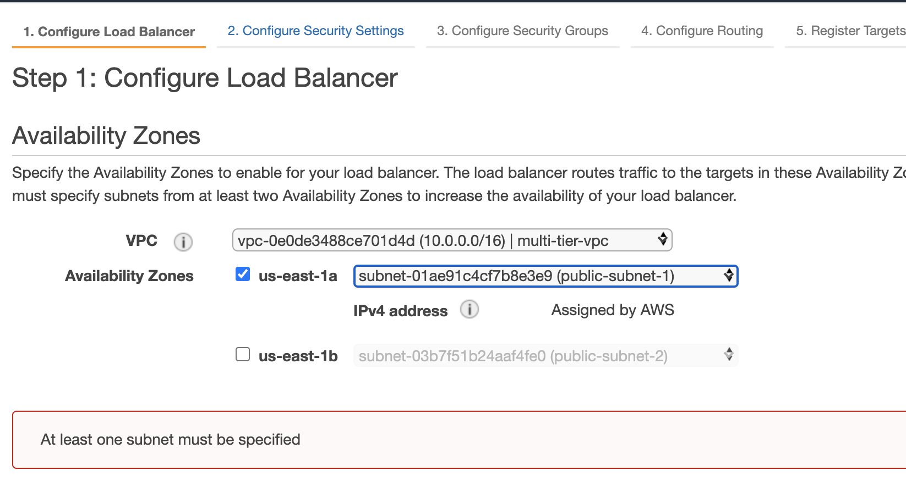
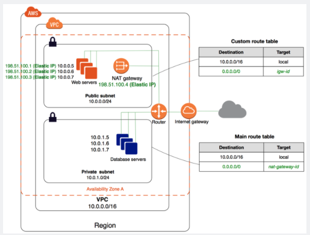

## CIDR - IPv4

stands for Classless Inter-Domain Routing -> help to define an IP range -> base IP/Subnet Mask

-> e.g. 10.0.0.0/24

subnet maks defines how many bits can change in the IP, what does it mean?

basically how many IP address in the range. For example,

- **/32 allows for 1 IP = 2^0**
- /31 allowsfor 2IP     = 2^1
- /30allowsfor  4IP     =2^2
- /29allowsfor  8IP     =2^3
- /28allowsfor  16IP    =2^4
- /27allowsfor  32IP    =2^5
- /26allowsfor  64IP    =2^6
- /25allowsfor  128IP   =2^7
- **/24         256IP    =2^8**
- **/16         65,536IP =2^16** the largest IPs available
- **/0          allIPs=2^32**

The max CIDR in AWS is /16

192.168.0.0/24= ..? -> the last two number can change

a tool to check https://www.ipaddressguide.com/cidr

### private IP allowed ranges

Private IP can only allow certain values
- 10.0.0.0 – 10.255.255.255 (10.0.0.0/8) <= in big networks
- 172.16.0.0 – 172.31.255.255 (172.16.0.0/12) <= default AWS one
- 192.168.0.0 – 192.168.255.255 (192.168.0.0/16) <= example: home networks

- All the rest of the IP on the internet are public IP

## Default VPC
- Default VPC have internet connectivity and all instances have public IP
- each VPC should link to subnets, route table, link to igw- (internet gateway), and one network ACL (inbound/outbound traffic)

## VPC
Virtual Private Cloud 
- max 5 per region
- max CIDR per VPC is 5, because VPC is private only private IP ranges available

- should not overlap with your other networks .e.g. company

## Internet Gateway
- Internet gateways helps our VPC instances connect with the internet 
- It scales horizontally and is HA and redundant
- Must be created separately from VPC
- OneVPC can only be attached to one IGW and vice versa
- Internet Gateway is also a NAT for the instances that have a public IPv4

Note: you must edit route table to internet gateway, since IG doesn't do it.

## Subnets

Notes: AWS reserves 5 IPs address (first 4 and last 1 IP address) in each Subnet

what are they? network address, VPC router, mapping to DNS, future use.

So it needs to select more IPs.

### How to tell if a subnet is public or private?

Public subnets have a default route to an Internet Gateway; private subnets do not.

### Resources living in subnets

- ELB and ASG need to live in subnets, and cross multiple subnets to achieve high availability

## NAT Gateway
Network Address Translation, because machines in private subnets need to access internet, why?
-> it needs to run software update, or download packages, etc. 

If there is no NAT gateway, they cannot access to internet.

also, NAT gateway lives in public subnets. 

AWS managed NAT, higher bandwidth, better availability, no admin
- Pay by the hour for usage and bandwidth
- NAT is created in a specific AZ, uses an EIP
- Cannot be used by an instance in that subnet (only from other subnets) 
- Requires an IGW (Private Subnet => NAT => IGW)
- 5 Gbps of bandwidth with automatic scaling up to 45 Gbps 
- No security group to manage / required

### How to enable multiple AZ availability?
To create an Availability Zone-independent architecture, create a NAT gateway in each Availability Zone and configure your routing to ensure that resources use the NAT gateway in the same Availability Zone.

Note: the route table for the private subnet needs to be configured with NAT, which lives in public subnet

## Egress Gateway
**only for IPv6**, similar as NAT, but NAT is for IPv4.

## Network ACL (NACL)

What is the usage for it? -> **control the access at subnet level. it is like a firewall**.

default NACL is to allow everything.

One NACL per subnet, new subnets got assigned to Default.

normally it is enough to use security, but it adds additional security on top.

NACL is stateless, while security grouop is stateful for inbound or outbound

## VPC Endpoints
they are used to **access to AWS services from a private subnet**
- They're a way to access AWS services privately within your VPC (without using the public internet). 

they scale horizontally and are redundant

why? without it, the resources in the private subnet have to go through the public internet, which is not secure.

### two types of VPC endpoint

There are two types of VPC endpoints: interface endpoints and gateway endpoints. 

As a rule of thumb, most AWS services use VPC Interface Endpoint 
- except for **S3 and DynamoDB, which use VPC Gateway Endpoint.**

## Flow Logs
send IP traffic logs of VPC, subnet, ENI to S3/cloudwatch

helpful to monitor or troubleshoot, e.g. find out which endpoint

## Bastion Hosts

- use it to SSH into private subnets
    - which is based on TCP, and is layer 4, so ALB does not work.
    - NLB supports Layer 4.

- bastion lives in public, connecting all other private subnets.

## Connect to VPCs
Expose your service to other VPCs

### Site to Site VPN (public)
- requires VPN Gateway (AWS VPN connection) + Site to Site VPN + Customer Gateway (software or physicalin customer DC)

### Direct Connect (private)
- it is **private** - Direct Connect Gateway to one or more VPC in many different regions
- private connection from a remote network to your VPC
- use case hybrid env (on prem + cloud)

### VPN CloudHub (multiple public customer networks)
VPN goes the public internet -> connect **multiple customer networks**

### PrivateLink (expose services to VPCs)
- Most secure & scalable (fault tolerant if NLB and ENI in multiple AZ) way to expose a service to 1000s ofVPC (own or other accounts)
- Requires a network load balancer (Service VPC) and ENI (Customer VPC)

### VPC Peering (1 with 1 VPC)
it is used to connect two VPCs, which can from the same aws account or different, or different region as well.

- both VPC should update Route Table.
- it is not transitive, meaning the peering does not transit to the next. e.g. VPC A <-> VPC B <-> VPC C, does not mean A can talk to C.

note: both VPC should not have overlap in CIDR, because IPs cannot be duplicate.

### Transit Gateway (thousands of VPCs, and VPNs)

- peering between **thousands of VPCs** and on-premise, hub and spoke connection
    cannot use vpc peering, because it is tedious to create route table for a lot of VPCs
- across regions
- works with direct connect gateway, VPN connections

- it is a single gateway like star relationship

https://aws.amazon.com/transit-gateway/

Recommend: use private network, instead of public, reason: 1) save cost 2) performance

## ENI

An elastic network interface is a logical networking component in a VPC that represents **a virtual network card**. 

- You can create a network interface, attach it to an instance, detach it from an instance, and attach it to another instance. The attributes of a network interface follow it as it's attached or detached from an instance and reattached to another instance. 

- **When you move a network interface from one instance to another, network traffic is redirected to the new instance.**

https://docs.aws.amazon.com/AWSEC2/latest/UserGuide/using-eni.html#scenarios-enis

